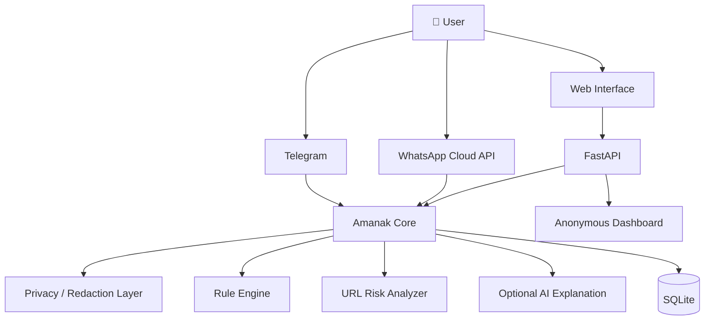

# 🛡️ Amanak — أمانك

### Your family's second opinion on suspicious messages.

**Amanak** is a free scam-detection assistant built for Egyptian families. It analyzes suspicious messages, links, and scam patterns and explains the risk in **simple Egyptian Arabic** — without requiring users to understand cybersecurity terminology.

<p align="center">
  
</p>
> **"قبل ما تدفع، ابعت لأمانك."**
> *Before you pay, send it to Amanak.*

---

## 🇪🇬 Why Amanak?

Scams don't always look like scams.

A message may claim:

* 💰 You won a prize
* 🏦 Your bank account will be suspended
* 📦 Your package needs a payment
* 💳 Your card requires verification
* 📱 Your WhatsApp account is at risk
* 🧾 You have an unpaid bill
* 👨‍👩‍👧 A family member urgently needs money
* 🔗 You need to click a link to "confirm" something

For technically experienced users, these messages may be obvious.

For parents, grandparents, and less technical family members, they may look completely legitimate.

**Amanak provides a simple second opinion before the user clicks, pays, or shares information.**

---

# ✨ What Amanak Does

A user can forward a suspicious message to Amanak.

Amanak analyzes the message and returns:

```text
🚨 غالبًا دي رسالة نصب

درجة الخطورة: 🔴 عالية

ليه؟
• الرابط مش موثوق
• الرسالة بتطلب بيانات شخصية
• فيها استعجال وضغط عليك
• طريقة الكلام شبيهة برسائل النصب المعروفة

❌ متضغطش على اللينك
❌ متبعتش بياناتك
❌ متحولش فلوس

لو مش متأكد، تواصل مع الجهة الرسمية من موقعها الحقيقي.
```

The goal is not simply to say **"scam"**.

The goal is to explain **why** the message is suspicious and tell the user **what to do next**.

---

#  Core Features

###  Scam Detection

Rule-based analysis identifies common scam indicators including:

* Suspicious URLs
* Domain anomalies
* Urgency and pressure
* Requests for money
* Credential requests
* Prize/lottery scams
* Fake delivery messages
* Account suspension claims
* Impersonation patterns
* Social-engineering language

### 🔗 URL Risk Analysis

Amanak can inspect links for suspicious characteristics such as:

* URL structure
* Suspicious domains
* Look-alike domains
* HTTP vs HTTPS
* Unusual redirects
* IP-based URLs
* URL shorteners
* Suspicious TLDs
* Known risk indicators

### 🇪🇬 Egyptian Arabic

The response layer is designed around everyday Egyptian Arabic rather than technical cybersecurity terminology.

Instead of:

> "The message contains indicators consistent with credential phishing."

Amanak can say:

> **"الرسالة دي شكلها محاولة تاخد بيانات حسابك."**

---

### 🇬🇧 English Support

If the user communicates in English, Amanak can respond in English.

```text
⚠️ High Risk

This message contains several phishing indicators:

• Suspicious link
• Urgency
• Request for sensitive information
• Untrusted domain

Do not click the link or provide credentials.
```

---

# 📱 Supported Interfaces

| Interface           | Status      |
| ------------------- | ----------- |
| Telegram            | ✅           |
| Web                 | ✅           |
| WhatsApp            | 🧪 Optional |
| Messenger           | 🗺️ Planned |
| SMS workflows       | 🗺️ Planned |
| OCR                 | 🧪 Optional |
| Voice transcription | 🧪 Optional |

---

#  Detection Pipeline

Amanak uses a layered analysis pipeline rather than relying on a single AI model.

```text
                    ┌──────────────────┐
                    │   User Message   │
                    └────────┬─────────┘
                             │
                             ▼
                    ┌──────────────────┐
                    │ Input Processing │
                    └────────┬─────────┘
                             │
              ┌──────────────┼──────────────┐
              ▼              ▼              ▼
        ┌──────────┐   ┌───────────┐   ┌──────────┐
        │ Message │   │ URL / Link │   │ Metadata │
        │ Analysis │   │  Analysis  │   │ Analysis │
        └────┬─────┘   └─────┬─────┘   └────┬─────┘
             │               │              │
             └───────────────┼──────────────┘
                             ▼
                    ┌──────────────────┐
                    │  Rules Engine    │
                    └────────┬─────────┘
                             │
                             ▼
                    ┌──────────────────┐
                    │ Risk Calculation │
                    └────────┬─────────┘
                             │
                    ┌────────┴────────┐
                    ▼                 ▼
             ┌────────────┐   ┌─────────────┐
             │ Risk Level │   │ Explanation │
             └─────┬──────┘   └──────┬──────┘
                   │                 │
                   └────────┬────────┘
                            ▼
                    ┌──────────────────┐
                    │ Egyptian Arabic  │
                    │ Response Layer   │
                    └────────┬─────────┘
                             │
                             ▼
                    ┌──────────────────┐
                    │      User        │
                    └──────────────────┘
```

---

# 🏗️ Architecture



---

#  Security Philosophy

Amanak is designed around **data minimization**.

The system should not need to know who the user is in order to determine whether a message looks suspicious.

### By default, Amanak does NOT store:

* Full user identity
* Passwords
* Authentication tokens
* Payment credentials
* Raw messages
* Contact lists
* Personal address books

Instead, the system can retain limited anonymous metadata required for analytics and abuse prevention.

Example:

```json
{
  "platform": "telegram",
  "verdict": "high_risk",
  "scam_type": "phishing",
  "risk_score": 87,
  "timestamp": "2026-10-07T00:00:00Z"
}
```

User identifiers should be represented using a **salted hash** rather than storing the original identifier.

---

# 🧹 Privacy / Redaction Layer

When a user explicitly reports a suspicious message, sensitive information should be removed before storage.

Example:

```text
Before:

"Your account 123456789 has been suspended.
Call 01012345678 or email attacker@example.com."

After:

"Your account [ACCOUNT_NUMBER] has been suspended.
Call [PHONE] or email [EMAIL]."
```

Potentially sensitive fields include:

```text
PHONE NUMBER
EMAIL ADDRESS
ACCOUNT NUMBER
NATIONAL ID
CARD NUMBER
OTP
PASSWORD
AUTHENTICATION TOKEN
```

---

#  Risk Levels

Amanak uses understandable risk categories.

### 🟢 Low Risk

No major scam indicators detected.

### 🟡 Suspicious

Some indicators are present.

The user should verify the information independently.

### 🟠 High Risk

Multiple scam indicators detected.

The user should avoid clicking links or providing information.

### 🔴 Critical

Strong indicators of phishing, impersonation, payment fraud, or credential theft.

The user should stop interacting with the sender and verify through an official channel.

---

# 🤖 Optional AI Layer

AI is **not required for the core detection engine**.

The rules engine remains the primary decision-making component.

The optional AI layer can:

* Explain why a message is suspicious
* Translate technical findings into Egyptian Arabic
* Generate user-friendly recommendations
* Improve explanation quality

The AI layer should **not blindly override deterministic security rules**.

A recommended architecture is:

```text
Rules Engine
     │
     ▼
Risk Score
     │
     ├──────────────► Final Verdict
     │
     ▼
Optional AI
     │
     ▼
Human-friendly Explanation
```

This keeps the system useful even when the AI service is unavailable.

---

#  Example

### User

```text
مبروك! كسبت 50,000 جنيه 🎉
اضغط هنا لتأكيد استلام الجائزة:
https://example-suspicious-domain.com/winner
```

### Amanak

```text
🚨 خلي بالك — الرسالة دي غالبًا نصب.

درجة الخطورة: 🔴 عالية

الأسباب:
• بتقول إنك كسبت جائزة غير متوقعة
• بتطلب منك الضغط على لينك
• فيها استعجال لتأكيد الاستلام
• الرابط مش واضح إنه تابع لجهة رسمية

❌ متضغطش على اللينك.
❌ متبعتش بيانات البطاقة أو الحساب.
❌ متحولش أي فلوس علشان "تستلم الجائزة".

لو الجائزة حقيقية، ادخل على الموقع الرسمي للجهة بنفسك
بدل الضغط على الرابط الموجود في الرسالة.
```

---

# 📊 Anonymous Dashboard

Amanak can provide an administrative dashboard containing aggregated statistics.

Possible metrics:

```text
Messages analyzed
        ↓
Scams detected
        ↓
Phishing attempts
        ↓
Suspicious URLs
        ↓
Top scam categories
        ↓
Platform distribution
```

Example:

| Metric              |  Value |
| ------------------- | -----: |
| Messages analyzed   | 12,481 |
| High-risk messages  |  3,104 |
| Suspicious URLs     |  2,217 |
| Phishing attempts   |  1,486 |
| Prize scams         |    623 |
| Fake delivery scams |    411 |

The dashboard should avoid exposing individual users or message contents.

---

# 🛠️ Tech Stack

### Backend

* Python 3.11+
* FastAPI
* SQLite
* Pydantic

### Messaging

* Telegram Bot API
* WhatsApp Cloud API *(optional)*

### Analysis

* Rule-based detection
* URL analysis
* Optional AI explanation
* OCR *(optional)*
* Speech-to-text *(optional)*

### Deployment

* Uvicorn
* Docker
* Render
* Any compatible Linux server

---

# ⚡ Quick Start

## 1. Clone the repository

```bash
git clone https://github.com/YOUR_USERNAME/amanak.git
cd amanak
```

## 2. Create a virtual environment

### Windows

```bash
python -m venv .venv
.venv\Scripts\activate
```

### Linux / macOS

```bash
python3 -m venv .venv
source .venv/bin/activate
```

## 3. Install dependencies

```bash
pip install -r requirements.txt
```

## 4. Configure environment variables

```bash
cp .env.example .env
```

Windows:

```powershell
copy .env.example .env
```

Edit `.env`:

```env
TELEGRAM_TOKEN=your_bot_token

ENABLE_WHATSAPP=false

DATABASE_URL=sqlite:///./amanak.db

AI_ENABLED=false
```

## 5. Start the server

```bash
uvicorn main:app --reload
```

Amanak should now be available locally.

```text
http://127.0.0.1:8000
```

---

# 🤖 Telegram Setup

1. Open Telegram.
2. Search for **@BotFather**.
3. Run:

```text
/newbot
```

4. Choose the bot name.
5. Copy the generated token.
6. Add it to `.env`:

```env
TELEGRAM_TOKEN=YOUR_TOKEN
```

7. Start Amanak.

For local development, polling can be used.

For production, configure a secure HTTPS webhook.

### Example commands

```text
/start
/help
/check
/report
/privacy
```

---

# 📲 WhatsApp Cloud API

WhatsApp support is optional and can remain disabled during development.

```env
ENABLE_WHATSAPP=false
```

To enable it:

```env
ENABLE_WHATSAPP=true
```

The production webhook should:

1. Verify the webhook challenge.
2. Validate `X-Hub-Signature-256`.
3. Reject invalid requests.
4. Rate-limit incoming events.
5. Sanitize incoming content.
6. Pass the message to Amanak Core.

---

# 🧪 Testing

Run the complete test suite:

```bash
pytest -q
```

Run the accuracy sanity check:

```bash
python scripts/run_accuracy.py
```

Recommended tests include:

```text
✓ obvious phishing
✓ fake prize message
✓ fake delivery message
✓ bank impersonation
✓ legitimate bank message
✓ suspicious URL
✓ URL shortener
✓ Arabic message
✓ English message
✓ mixed Arabic/English
✓ empty input
✓ malformed URL
✓ rate limiting
✓ webhook signature validation
✓ privacy redaction
```

---

# 🐳 Docker

Build:

```bash
docker build -t amanak .
```

Run:

```bash
docker run --env-file .env -p 8000:8000 amanak
```

---

# ☁️ Deployment

Amanak can be deployed to services supporting Python applications or containers.

Example:

```text
                    ┌───────────────┐
                    │    Internet   │
                    └───────┬───────┘
                            │
                            ▼
                    ┌───────────────┐
                    │ HTTPS / Proxy │
                    └───────┬───────┘
                            │
                            ▼
                    ┌───────────────┐
                    │    FastAPI    │
                    └───────┬───────┘
                            │
              ┌─────────────┼─────────────┐
              ▼             ▼             ▼
          Telegram      Amanak Core     Dashboard
                            │
                     ┌──────┴──────┐
                     ▼             ▼
                  SQLite       URL Analysis
```

---

# 🚦 Rate Limiting & Abuse Protection

Public deployments should implement rate limiting to prevent abuse.

Recommended controls:

```text
Per-user rate limit
        +
Per-IP rate limit
        +
Webhook validation
        +
Input size limits
        +
URL limits
        +
Request timeout
```

The Telegram bot should also reject excessively large payloads.

---

# ⚠️ Important Limitations

Amanak is a **risk-assessment tool**, not an oracle.

A legitimate message can sometimes look suspicious.

A sophisticated scam can sometimes bypass automated detection.

Therefore:

> **Amanak should help users pause and verify — not make irreversible financial decisions for them.**

For financial, government, banking, or account-security messages, users should verify information through the organization's official website, application, phone number, or physical branch.

---

# 🗺️ Roadmap

### Phase 1 — Core

* [x] Rule-based scam detection
* [x] URL analysis
* [x] Egyptian Arabic responses
* [x] English fallback
* [x] Telegram support
* [x] SQLite metadata storage

### Phase 2 — Protection

* [ ] Improved phishing detection
* [ ] Domain reputation intelligence
* [ ] Look-alike domain detection
* [ ] OCR
* [ ] Voice transcription
* [ ] Better abuse prevention
* [ ] Family safety alerts

### Phase 3 — Expansion

* [ ] WhatsApp production integration
* [ ] Messenger
* [ ] SMS workflows
* [ ] More Egyptian dialect patterns
* [ ] Community reporting
* [ ] Scam trend intelligence

### Phase 4 — Intelligence

* [ ] Improved contextual analysis
* [ ] Scam campaign clustering
* [ ] Anonymous threat intelligence
* [ ] Real-time scam trend detection
* [ ] Community-driven detection rules

---

# ❤️ Built for Families

Amanak is intentionally designed around a simple idea:

> **Cybersecurity shouldn't require technical knowledge.**

A parent shouldn't need to understand:

```text
phishing
social engineering
homograph attacks
URL reputation
credential harvesting
domain spoofing
```

They should be able to ask:

> **"الرسالة دي نصب ولا لأ؟"**

And receive an answer they can understand.

---

# 🤝 Contributing

Contributions are welcome.

Before submitting a pull request:

* Keep changes focused.
* Add tests for new detection rules.
* Do not commit secrets.
* Do not commit real user messages.
* Do not add unnecessary personal-data collection.
* Document new detection logic.
* Preserve privacy-by-default behavior.

### Development principles

```text
Security first
Privacy first
Simple UX
Explainable detection
Minimal data collection
Test everything
```

---

#  Security

If you discover a security vulnerability in Amanak, please do not publicly disclose sensitive details before giving the maintainers an opportunity to investigate.

Security reports should include:

* Affected component
* Reproduction steps
* Expected behavior
* Actual behavior
* Security impact
* Suggested remediation, if available

Do not include real victims' personal information, credentials, financial information, or private messages in a report.

---

# 📜 License

Amanak is provided as a prototype for **educational and humanitarian purposes**.

It is not a:

* Legal service
* Financial advisory service
* Banking security service
* Emergency-response service

The software is intended to help people **identify suspicious communication and pause before taking risky actions**.

---

# 🇪🇬 Amanak

### أمانك — قبل ما تثق، اسأل.

**A free, privacy-conscious scam-checking assistant built for Egyptian families.**

> **Your family's second opinion on suspicious messages.**
