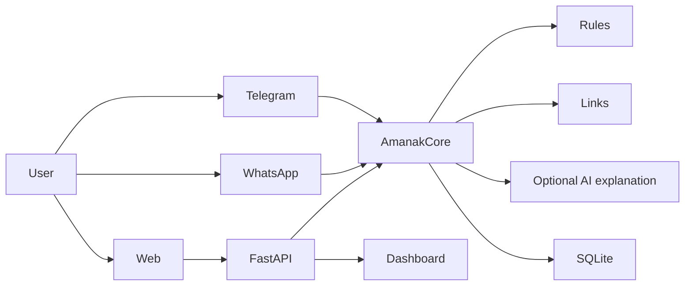

# Amanak: a free scam-checking bot for Egyptian families

Amanak (أمانك) is a free chatbot that helps Egyptian families decide whether a suspicious message is likely a scam. The bot explains risk in simple Egyptian Arabic and is designed for older relatives and people who do not trust complicated tech terms.

## Tagline

"Your family's second opinion on suspicious messages."

## Story and problem

Scam messages in Egypt often arrive by SMS, WhatsApp, Telegram, or forwarded family chats. Many people get a message that sounds urgent, asks for money, or claims they won a prize or that a bill is due. The goal of Amanak is to make that first warning simple, fast, and understandable without requiring a paid service.

## Features

- Rule-based scam analysis with URL risk checks
- Simple Egyptian Arabic replies for non-technical users
- English fallbacks when the user writes in English
- Telegram support with commands and rate limiting
- Optional WhatsApp integration behind feature flags
- SQLite storage with limited metadata only
- Dashboard for anonymous stats
- OCR and optional voice transcription behind configuration flags

## Screenshots

- Screenshot placeholder: Telegram chat with a scam verdict
- Screenshot placeholder: dashboard overview
- Screenshot placeholder: family safety alert card

## Architecture



## Setup

### Windows

1. Install Python 3.11+
2. Create a virtual environment:
   - python -m venv .venv
   - .venv\Scripts\activate
3. Install dependencies:
   - pip install -r requirements.txt
4. Copy .env.example to .env and edit values.
5. Run the app:
   - uvicorn main:app --reload

### Mac/Linux

1. Python 3.11+
2. python3 -m venv .venv
3. source .venv/bin/activate
4. pip install -r requirements.txt
5. cp .env.example .env
6. uvicorn main:app --reload

## Telegram bot setup

1. Open Telegram and message @BotFather.
2. Run /newbot and choose a name.
3. Copy the token.
4. Save it to TELEGRAM_TOKEN in the .env file.
5. Optional: set a webhook URL or use polling mode during local testing.
6. Suggested usernames: AmanakBot or Amanak_Egypt_bot.

## WhatsApp Cloud API setup (optional)

1. Create a Meta app and enable WhatsApp.
2. Add the verify token and app secret to .env.
3. Set ENABLE_WHATSAPP=true.
4. Configure your webhook with the public URL and verify token.
5. Make sure the app verifies the X-Hub-Signature-256 header.

## Running tests

```bash
pytest -q
python scripts/run_accuracy.py
```

## Deployment

- Local: uvicorn main:app --host 0.0.0.0 --port 8000
- Docker: docker build -t amanak . && docker run -p 8000:8000 amanak
- Render: use render.yaml as the starting point and configure environment variables in the dashboard.

## Privacy

Amanak does not store raw message text by default. The system stores only limited metadata like time, platform, verdict, scam type, score, and a salted hash of the user ID. Raw text is stored only when the user explicitly triggers a report after masking phone numbers, emails, account numbers, and IDs.

## Limitations

- A rules-only engine can still make mistakes.
- The system is designed for family safety guidance, not legal or financial certainty.
- Synthetic accuracy is a sanity check, while real-world data depends on what families actually receive.
- The optional AI explanation is not required and should only adjust decisions by one level when enabled.

## Roadmap

- Messenger support
- SMS verification flows
- More Egyptian dialect coverage
- Better OCR and voice transcription
- Better family alert workflows

## Contributing

Pull requests are welcome. Keep changes focused, add tests, and avoid storing user secrets in code or repo files.

## License

This project is provided as a prototype for educational and humanitarian use. It is not a legal or financial advisory service.
